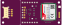
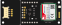

# AM7020-module-fritzing-part

## 喜歡請給個星星吧Orz

由於v1.0的grove插座設計有失誤所以此fritzing part會分成v1.0 和 v1.1兩個版本  
Due to an error in the design of the grove socket in v1.0, this fritzing part will be divided into two versions: v1.0 and v1.1

This is AM7020 v1.0 fritzing part  
  
This is AM7020 v1.1 fritzing part  
  
你可以自由使用這個fritzing part，但是請標註作者  
You are free to use this fritzing part(by giving me a star  and mark the author)  

請注意本圖示pcb部分僅供參考，本人不負責任和pcb生產時產生誤差的損失  
The pcb part of this picture is for reference only, and I am not responsible for the loss caused by errors in the production of pcb  
pcb部分建議使用正規電路設計軟體設計  
It is recommended to use circuit design software to design the pcb part  

## Specification  

Specification Hardware Features
Model: AM7020
Antenna Type: IPEX connect  
Major Chipset: SIM7020E  
Power Supply: 5 ~ 24V V  
Dimension: 62 25.4mm (LxW)  
Frequency Range:B1/B3/B5/B8/B20/B28  
Communication Protocol:HTTP(S)/MQTT(S)/TCP/UDP....  
AT Commands:V.25TER, 3GPP TS 27.007, and SIMCOM AT Commands)  
Baudrate:300bps ~ 921600bps  
Pin position and size support Arduino MKR series products  

[buy it (icshop)](https://www.icshop.com.tw/products/368030200686)  
[design by (CIRCUS Pi)](https://www.oursteam.com.tw/products.php?subkey=102)  
[SIM7020E Doc](https://drive.google.com/drive/folders/1Gj1yMGtAKptdAnLiivfE83pxRC3m5YrO)  

## MIT License

MIT License

Copyright (c) 2024 HuangYuTse

Permission is hereby granted, free of charge, to any person obtaining a copy
of this software and associated documentation files (the "Software"), to deal
in the Software without restriction, including without limitation the rights
to use, copy, modify, merge, publish, distribute, sublicense, and/or sell
copies of the Software, and to permit persons to whom the Software is
furnished to do so, subject to the following conditions:

The above copyright notice and this permission notice shall be included in all
copies or substantial portions of the Software.

THE SOFTWARE IS PROVIDED "AS IS", WITHOUT WARRANTY OF ANY KIND, EXPRESS OR
IMPLIED, INCLUDING BUT NOT LIMITED TO THE WARRANTIES OF MERCHANTABILITY,
FITNESS FOR A PARTICULAR PURPOSE AND NONINFRINGEMENT. IN NO EVENT SHALL THE
AUTHORS OR COPYRIGHT HOLDERS BE LIABLE FOR ANY CLAIM, DAMAGES OR OTHER
LIABILITY, WHETHER IN AN ACTION OF CONTRACT, TORT OR OTHERWISE, ARISING FROM,
OUT OF OR IN CONNECTION WITH THE SOFTWARE OR THE USE OR OTHER DEALINGS IN THE
SOFTWARE.
